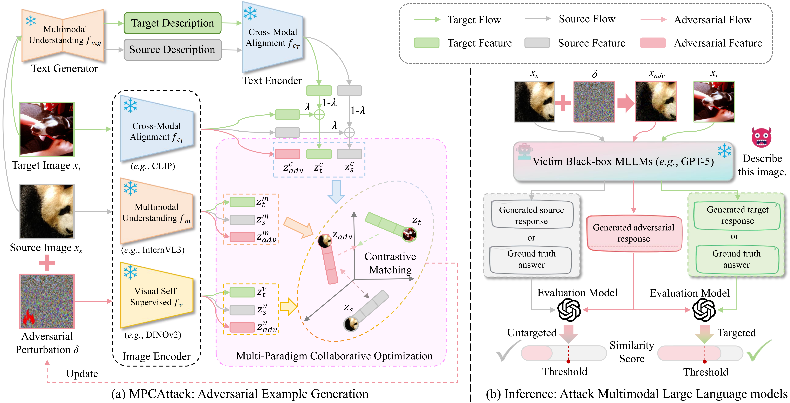
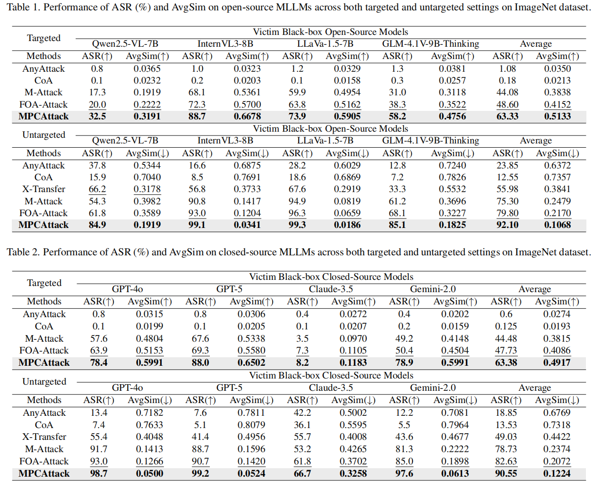
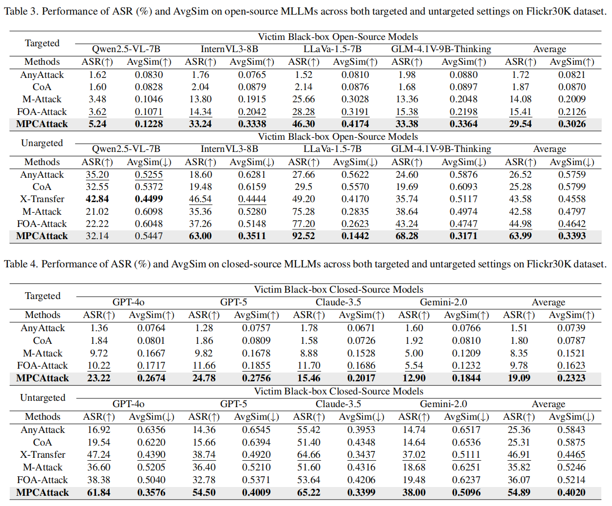

# Multi-Paradigm Collaborative Adversarial Attack Against Multimodal Large Language Models

This repository is the official implementation of *Multi-Paradigm Collaborative Adversarial Attack Against Multimodal Large Language Models*.
[[Paper](https://arxiv.org/abs/2603.04846)]

<div align="center">
    
</div>

> Overview of the proposed MPCAttack: (a) Pipeline for MPCAttack in adversarial examples generation. (b) Pipeline for attacking MLLMs.


## Requirements

To install requirements:

```bash
conda create -n MPCAttack python=3.10
conda activate MPCAttack
pip install torch==2.6.0 torchvision==0.21.0 torchaudio==2.6.0 --index-url https://download.pytorch.org/whl/cu118
pip install -U transformers
pip install hydra-core pytorch-lightning opencv-python scipy nltk timm==1.0.1 pandas
pip install git+https://github.com/openai/CLIP.git
```

Install from requirements file
```bash
pip install -r requirements.txt
```

## Quick Start

1. **Prepare Data**  
   Download the datasets from this [link](https://drive.google.com/file/d/131R1aOnKS8RaDvq7pDbdGF-k--USBgi1/view?usp=sharing).

2. **Generate Adversarial Examples**

    ```bash
    python generate_adversarial_examples_MPCAttack.py --output ./MPCAttack
    ```
3. **Evaluation**

   The evaluation is seperated into two parts:

   1. generate descriptions for clean and adversarial images on target blackbox model
   2. evaluate the Attack Success Rate (ASR) and Similarity score

   For the first part, run:
   ```bash
    python python blackbox_text_generation.py --output ./MPCAttack --model_name Qwen2.5-VL-7B-Instruct
    ```
   
   > Note1: In the first run of the first part, the source image, the target image, and the text description of the adversarial example are generated simultaneously. 
   > When the text description file of the source image and the target image already exists, it will be skipped to avoid duplicate generation.

   > Note2: All open-source MLLMs are evaluated using the [VLMEvalKit](https://github.com/open-compass/VLMEvalKit) toolkit. 
   > You can update the vlmeval folder to reference VLMEvalKit to use the latest open-source models.

   > Note3: When the target model is a closed-source model, the corresponding API needs to be configured. 
   > Create api_keys.yaml under the root following this template:

   ```yaml
   # API Keys for different models
   # DO NOT commit this file to git!
   
   gpt4v: "your_api_key"
   claude: "your_api_key"
   claude4_5: "your_api_key"
   gemini: "your_api_key"
   gpt4o: "your_api_key"
   gpt5: "your_api_key"
   gpt-4o-mini: "your_api_key"
   ```
   
   For the second part, run:
   ```bash
   python gpt_evaluate.py --output ./MPCAttack --model_name Qwen2.5-VL-7B-Instruct
   ```

   > Note: The evaluation model is gpt-4o-mini model, so we also need to configure the api key.


## Results





## Visualization

- Visualization of adversarial images and perturbations.


- Visualization of adversarial images in attacking commercial MLLMs.


## Acknowledgments


We sincerely thank [M-Attack](https://github.com/VILA-Lab/M-Attack/tree/main) and [FoA-Attack](https://github.com/jiaxiaojunQAQ/FOA-Attack) for their outstanding work.

## Citation


[//]: # (```)

[//]: # ()
[//]: # (@article{nie2025v,)

[//]: # ()
[//]: # (  title={V-Attack: Targeting Disentangled Value Features for Controllable Adversarial Attacks on LVLMs},)

[//]: # ()
[//]: # (  author={Nie, Sen and Zhang, Jie and Yan, Jianxin and Shan, Shiguang and Chen, Xilin},)

[//]: # ()
[//]: # (  journal={arXiv preprint arXiv:2511.20223},)

[//]: # ()
[//]: # (  year={2025})

[//]: # ()
[//]: # (})

[//]: # ()
[//]: # (```)